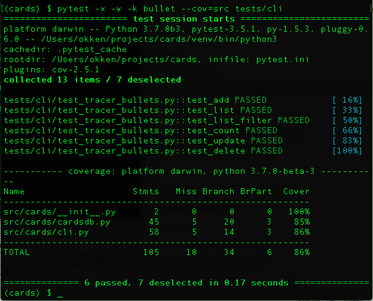

% Visual Testing with PyCharm and pytest
% Brian Okken & Paul Everitt
% May 11, 2018

------------

## Brian Okken

Author of "Python Testing with pytest"<br>
Host of "Test & Code" podcast<br>
Co-Host of "Python Bytes" podcast<br>
Lead Software Engineer at Rohde & Schwarz

------------

## Paul Everitt

PyCharm and WebStorm Developer Advocate at JetBrains

------------

## Visual Testing with PyCharm and pytest

------------

## a lot of ground to cover

* TDD in 5 slides
* why pytest
* why PyCharm
* demo as much as we can
* have fun

<aside class="notes">
*Notes:*

I'm really excited to be here today, and have you here.

Testing is a topic I'm passionate about. It's not becuase I love writing
tests more than I love writing other code.
It's because I believe a thoughtful use of testing practices, frameworks,
and tools saves me time and allows me more time to play with the code.
</aside>

---------


(courtesy http://moonlander.seb.ly/)

<aside class="notes">
*Notes:*

It's 1980-something, and I had a TRS-80 computer from Radio Shack.
I one game cartrige, Labaryinth, which I quickly became tired of.

At the time, there were magazines dedicated to the TRS-80 that contained code
listings in basic for you to type in yourself. Some of them were games.

My favorite was Lunar Lander.

After I mastered the game itself, I played with the code.

I changed how effective the thrust was, modified the gravity calculation,
tried to disable collisions, etc. And then played the game to see what the
affect was.

None of my changes made the game more fun. Most made the game unplayable.
But I was trying things out without fear. Just me and the code.

I like to have fun while coding.

For me, automated testing, especially using pytest and PyCharm, are a way to
release my geek. To let my inner hacker run wild. To play with code, to try new
things, to gain knowledge, learn from my mistakes, and not be afraid to
break things.
And to make software that I am proud of.

I want you to have that.

All of what we are going to talk about is to try to minimize the pain of programming
and increase the joy.

To increase the odds of having a great day coding.
</aside>

---------

## TDD crash course

<aside class="notes">
*Notes:*

I want to do a 5 slide crash course on Test Driven Development.

At the end of the slide deck I have a link to a podcast episode that describes
TDD in more detail. So don't worry if you don't quite get it in 5 slides.

The reason I want to cover TDD is because the topics of automated testing and
TDD often are discussed together.
Even though you can do automated testing without TDD, I think they are better
together.
</aside>
---------

## Design->Develop->Test

doesn't work

and ... it's not fun

<aside class="notes">
*Notes:*

Testing only at the end doesn't work.
If tests reveal problems, then they are teaching you about your design or your
implementation.
If tests can help you learn about design and implementation, then starting them
earlier makes sense. So we can apply that learning earlier and make fewer mistakes.
</aside>
---------

## Test -> Design & Develop

way more fun

includes do-overs


<aside class="notes">
*Notes:*

So let's start testing right away, and have the tests help us all along the way.

It's like many school text books with questions at the end of each chapter.
If you are pressed for time (which I always was because I read slowly), then
read the questions first, before you read the chapter.
You can read faster, and when you run across something pertaining to those
questions, you can slow down and read carefully.

When developing software, if we can develop our questions first, then we can
code faster most of the time, and slow down during parts we don't quite
understand.

Of course, when we are just starting a project, we don't know all the questions
to ask, or the tests to write, so we start small and iterate through the project.
</aside>

---------

## TDD - traditional

* <span style="color:red">Red</span>: Write a failing test
* <span style="color:green">Green</span>: Make it pass
* Refactor: Clean up your code<br/>

<aside class="notes">
*Notes:*

TDD is often summarized kinda like this.
But for me, that doesn't really help me know what to do.
How do I write a failing test? Which tests should I write?
How many?
So I've got a different summary.
</aside>

---------

## TDD according to Brian

* <span style="color:red">Red</span>: Learn what it's like to use your code
* <span style="color:green">Green</span>: Learn one way to implement the code
* Refactor: Make code you are proud of

(and don't forget to refactory your tests, too)

<aside class="notes">
*Notes:*

this is my version.
Write tests that help you learn how the software will be used.
Ask questions about your code, design, API, ...
Then figure out one way to implement it. A rough draft.
Then go back and make the code maintainable, modular, whatever you think makes
code good code.

You will be more qualified to solve any coding problem after you've solved
it at least once.

With tests in place to make sure you don't muck things up to much, you have the
freadom to refactor small pieces up to big changes.

Refactoring sometimes is a non-step. Somethimes it's just cleaning up variable names
Sometimes it's bigger. Just because it's drawn as a third of the circle doesn't
mean it always takes a third of the time.

As you iterate, building up tests, building up code, you gain experience
necessary to make larger changes and decisions.

</aside>

---------

## Testing During Development


<aside class="notes">
*Notes:*

The small circles indicate roughly times where you are running a test suite of some kind.
The time it takes to write the tests, and the time it takes to run the tests, all subtract
from the time we get to wite either the first draft of the code or refactorings.

This is the suite spot (pun intended) where pytest and PyCharm help us out.
pytest helps us spend less time writing tests, and PyCharm helps us run tests
quickly while coding.

</aside>
---------

## The cards project

something to test

------------------

for those of you following along at home

```
$ git clone -b pycon_2018 https://github.com/okken/cards.git
$ cd cards
$ python3.6 -m venv venv --prompt cards
$ source venv/bin/activate  # venv\Scripts\activate  (if Windows)
(cards) $ pip install -r requirements_dev.txt
```

<aside class="notes">
*Notes:*

This is where you can get it.
</aside>

--------------

```
$ cards add -o okken "Prepare for PyCon talk"
$ cards add -o okken "Order stickers"
$ cards add -o okken "Order business cards"
$ cards add -o okken "pack"
$ cards update 2 --done True
$ cards update 3 --done True
$ cards list
  ID  owner    done    summary
----  -------  ------  ----------------------
   1  okken            Prepare for PyCon talk
   2  okken    x       Order stickers
   3  okken    x       Order business cards
   4  okken            pack
```

<aside class="notes">
*Notes:*

I've been using the cards project to explore testing concepts on an open source
project for the Test & Code podcast.
It's a todo list, with a command line interface.
Eventually, it we'll add a web interface and a REST API to explore testing even
further.
</aside>

--------------

```
cards
├── src
│   └── cards
│       ├── __init__.py
│       ├── cardsdb.py
│       └── cli.py
├── tests
│   ├── api
│   │   ├── __init__.py
│   │   ├── conftest.py
│   │   ├── test_tracer_bullets.py
│   │   └── ....
│   └── cli
│       ├── __init__.py
│       ├── conftest.py
│       ├── test_alac.py
│       └── ...
```

<aside class="notes">
*Notes:*

This is the structure mostly that pertains to the testing.
</aside>

-------

## pytest

-------

```
(cards) $ pytest --cov=src
================== test session starts ===================
tests/api/test_alac.py .                           [  2%]
tests/api/test_list_filter.py ...................  [ 50%]
tests/api/test_tracer_bullets.py .......           [ 67%]
tests/cli/test_alac.py .                           [ 70%]
tests/cli/test_list_format.py ......               [ 85%]
tests/cli/test_tracer_bullets.py ......            [100%]
----------- coverage: -----------
Name                    Stmts   Miss Branch BrPart  Cover
---------------------------------------------------------
src/cards/__init__.py       2      0      0      0   100%
src/cards/cardsdb.py       45      0     20      0   100%
src/cards/cli.py           58      0     14      0   100%
---------------------------------------------------------
TOTAL                     105      0     34      0   100%
=============== 40 passed in 0.77 seconds ================
```

<aside class="notes">
*Notes:*

You can just type pytest to run the tests.
This runs all of the tests.
But here I'm using the pytest-cov plugin to run coverage during testing.
</aside>


-------

pytest allows you to run a subset of tests

```
$ # one directory
$ pytest tests/cli

$ # one test module
$ pytest tests/cli/test_tracer_bullets.py

$ # one test function
$ pytest tests/cli/test_tracer_bullets.py::test_count
```

<aside class="notes">
*Notes:*

Like we talked about with the TDD cycle, sometimes you don't need to run
all of the tests. pytest has many ways to run a subset.
</aside>

-------

Some other ways to run a subset of tests

```
(cards) $ pytest --help
...
  -k EXPRESSION         just tests matching this expression
  -m MARKEXPR           run tests w/ given mark expression
  -x, --exitfirst       exit on first error/failed test
  --maxfail=num         exit after first num failures/errors.
  --lf, --last-failed   rerun failed tests from last run
  --ff, --failed-first  same, but then run the rest
  --nf, --new-first     run new test files, then the rest
```

<aside class="notes">
*Notes:*

Here are some more ways to run a subset of the tests.
Markers are especially useful if related tests are in different parts of the
directory structure.

When writing your first draft code to go from red to green, --lf -x in combination
are brilliant. That just runs the tests that failed previously and stops on the
first failure.

When developing tests, the --new-first saves time.
</aside>
---------

## More development speedups

* Fixtures: setup, teardown, resource and test data initialization, ...
* Parametrization: many test cases using the same test function
* Hooks and Plugins: the sky is the limit


<aside class="notes">
*Notes:*

Fixtures, parametrization, and plugins help even further in speeding up both
test writing time and test running time.
</aside>

-------------

## CLI vs Visual Testing

------------




<aside class="notes">
*Notes:*

</aside>

------------

## vs PyCharm

------------


------------


<aside class="notes">
*Notes:*

</aside>

-------------

## Some Setup

* PyCharm Community edition
* Use File->Open for existing projects
* Check the interpreter setting
* Check the default test runner

------------

Use File->Open for existing projects


------------

Check the interpreter setting


------------

Check the default test runner


---------

## Demo

* run at different levels
* see test durations
* auto-running tests
* run only failing tests
* jump directly the test failure
* see tests and code at the same time (TDD mode)
* debug tests and code together
* run REPL during a debug session

<aside class="notes">
*Notes:*

I think we should run through the first few items with working tests

* run all the tests
    * note the test durations in the results
* run just the cli tests, from the project tree
* run tracer bullets, from run window
* double click on one of the tests to bring up the test code
    * choose tests/api/test_list_filter
    * because it's a cool use of parametrization
* run that test from the code window gutter icon
* run the whole file from right click in whitespace
* run all the tests again
* turn on auto-run
* turn on 'select first failed tests'
* add a space or something in the test file and watch it autorun

Then add a test
* at the bottom of tests/cli/test_tracer_bullets.py is a
test that needs uncommented
# -----------------------------
# -- a possible first draft
# -----------------------------
# def test_get(db_empty, cards_cli):
# ...

* uncomment, the test should auto run.
* highight failure: "Error: No such command "get"."
* we can point out the use of fixtures with this test
* if you want, we can show the fixtures in conftest.py

Open src/cards/cli.py
* uncomment get_card()
* test should run and still fail

* Split the window.
* put breakpoint in both thest and get_card()
* restart the test in debug
* step through a few lines of get_card()
* point out that 'format' is 'simple'.
    * good point to open up REPL and talk about that
* higlight the default value to see what it is
* complete the test run
* add --format packed to test function call
* re-run the tests
* everything should pass now.
* The second draft is good to talk about pushing test setup into
  a fixture and creating parametrizations.
* We can look at the cli code for get and discuss places to fix it up.
    * moving common formatting of individual elements into a helper
    function maybe.

* A discussion point of the --format packed flag is that it was added
to make testing easier. But I made the decision that it was fine
to be in the public CLI becuase some other tool built on the API might find
it helpful for testing itself.


</aside>

----------

More info

* PyCharm: [jetbrains.com/pycharm/](https://www.jetbrains.com/pycharm/)
* Python Testing with pytest
    * [pragprog.com/book/bopytest](https://pragprog.com/book/bopytest/python-testing-with-pytest)
* pytest
    * [docs.pytest.org](https://docs.pytest.org/en/latest/)
    * [stackoverflow.com/search?q=pytest](https://stackoverflow.com/search?q=pytest)
* Lessons about testing and TDD from Kent Beck
    * [testandcode.com/23](http://testandcode.com/23)
* Twitter
    * @[brianokken](https://twitter.com/brianokken), @[testpodcast](https://twitter.com/testpodcast), [testandcode.com](http://testandcode.com)
    * @[paulweveritt](https://twitter.com/@paulweveritt), @[pycharm](https://twitter.com/pycharm)


