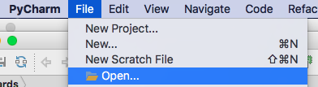
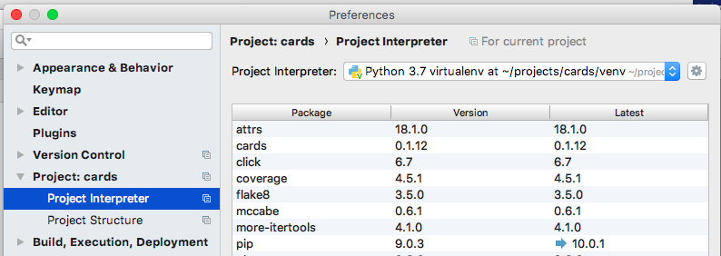
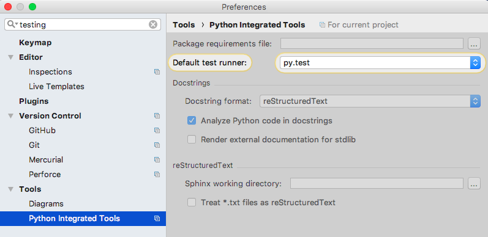

% Visual Testing with PyCharm and pytest
% Brian Okken & Paul Everitt
% May 11, 2018


# Who we are

## Paul Everitt

PyCharm and WebStorm Developer Advocate at JetBrains

<aside class="notes">
*Notes:*

What else should go here?
</aside>

## Brian Okken

Author of "Python Testing with pytest"<br>
Host of "Test & Code" podcast<br>
Co-Host of "Python Bytes" podcast<br>
Lead Software Engineer at Rohde & Schwarz

<aside class="notes">
*Notes:*

Grab some pics for this
</aside>

# TDD, pytest, and PyCharm

------------

## a lot of ground to cover

* TDD in 4 slides
* why pytest
* why PyCharm
* demo as much as we can

<aside class="notes">
*Notes:*

I'm really excited to be here today, and have you here.

Testing is a topic I'm passionate about. It's not becuase I love writing
tests more than I love writing the code under test. I'm passionate about it
becuase a thoughtful use of testing practices, frameworks, and tools saves me
time and allows me more time to play with the code under test.

We really don't have enough time to cover all of these topics to the
extent that they deserve. So my hope is that I can cover enough to get you
excited about all three.

---------


(courtesy http://moonlander.seb.ly/)

<aside class="notes">
*Notes:*

It's 1980-something, and I had a TRS-80 with one game, Labaryinth, that I quickly tired
of. So I would type in listings from the backs of magazines.

My favorite was Lunar Lander. It took me a long time to type that in and I
didn't understand it before I played it.

But after I mastered the game itself, I played with the code.

I would muck with the amount of fuel I was allowed, change how effective
thrust was, change the gravity calculation, disable collisions, etc.

None of my changes made the game more fun. Most made it rather unplayable.
But I was trying things out without fear. Just me and the code.

I want to have fun coding.

For me, automated testing, especially using pytest and PyCharm, are a way to
release my geek. To let my inner hacker run wild. To play with code, to try new
things, to gain knowledge, learn from my mistakes, and not be afraid to
break things.
And to make software that I am proud of.

I want you to have that.

All of what we are talking about is to try to minimize the pain of programming
and increase the joy.

And to increase the odds of having a great day coding.
</aside>

# TDD

## Design->Develop->Test

doesn't work

at least ... it's not fun

## Test First

~~Design->Develop->Test~~

Test -> Design & Develop

<aside class="notes">
*Notes:*

TDD started it's life as Test First Programming, with a simple idea.
It's like many school text books with questions at the end of each chapter.
They are written backwards. If you are pressed for time, read the questions
first, then when you run across something pertaining to those questions, you
can slow down and read carefully.

When developing software, if we can develop our questions first, then we can
code faster most of the time, and slow down during parts we don't quite
understand.
</aside>

## TDD - traditional

* <span style="color:red">Red: Write a failing test</span><br/>
* <span style="color:green">Green: Make it pass</span><br/>
* Refactor: Clean up your code<br/>

<aside class="notes">
*Notes:*

TDD is often summarized kinda like this. But for me, that doesn't
relate to what I want to do very much. So I've got a different summary.
</aside>

## TDD according to Brian

* <span style="color:red">Red: Learn what it's like to use your code</span>
* <span style="color:green">Green: Learn one way to implement the code</span>
* Refactor: Make code you are proud of

(and don't forget to refactory your tests, too)

<aside class="notes">
*Notes:*

You will be more qualified to solve any coding problem after you've solved
it at least once. TDD is about incorporating automated testing into your
development day to help you get through defining what your code is supposed
to do and your first draft as fast as possible so that you have time to reflect
and rewrite parts of it as you gain experience.

pytest and PyCharm are in alignment with this goal of giving you more time to
learn and grow and more time to write code you are proud of.
</aside>

# Let's test something

## The cards project

```
$ cards add -o okken "Prepare for PyCon talk"
$ cards add -o okken "Order stickers"
$ cards add -o okken "Order business cards"
$ cards add -o okken "pack"
$ cards update 2 --done True
$ cards update 3 --done True
$ cards list
  ID  owner    done    summary
----  -------  ------  ----------------------
   1  okken            Prepare for PyCon talk
   2  okken    x       Order stickers
   3  okken    x       Order business cards
   4  okken            pack
```

<aside class="notes">
*Notes:*

This is what we are going to test.
It's a todo list. So far, it has a CLI.
Eventually, we'll add at least one web interface.
Maybe start with Flask
</aside>

------------------

for those of you following along at home

```
$ git clone -b pycon_2018 https://github.com/okken/cards.git
$ cd cards
$ python3.6 -m venv venv --prompt cards
$ source venv/bin/activate  # venv\Scripts\activate  (if Windows)
(cards) $ pip install -r requirements_dev.txt
```

<aside class="notes">
*Notes:*

This isn't any kind of commentary towards venv and away from pipenv or anaconda or just raw Python.
It's just what I use at the moment, so I usually include it instructions.
</aside>

--------------

```
cards
├── src
│   └── cards
│       ├── __init__.py
│       ├── cardsdb.py
│       └── cli.py
├── tests
│   ├── api
│   │   ├── conftest.py
│   │   ├── test_alac.py
│   │   ├── test_list_filter.py
│   │   └── test_tracer_bullets.py
│   └── cli
│       ├── __init__.py
│       ├── conftest.py
│       ├── test_alac.py
│       ├── test_list_format.py
│       └── test_tracer_bullets.py
```

-------

`pytest` in action

```
(cards) $ pytest --cov=src
================== test session starts ===================
plugins: cov-2.5.1
collected 40 items

tests/api/test_alac.py .                           [  2%]
tests/api/test_list_filter.py ...................  [ 50%]
tests/api/test_tracer_bullets.py .......           [ 67%]
tests/cli/test_alac.py .                           [ 70%]
tests/cli/test_list_format.py ......               [ 85%]
tests/cli/test_tracer_bullets.py ......            [100%]

----------- coverage: -----------
Name                    Stmts   Miss Branch BrPart  Cover
---------------------------------------------------------
src/cards/__init__.py       2      0      0      0   100%
src/cards/cardsdb.py       45      0     20      0   100%
src/cards/cli.py           58      0     14      0   100%
---------------------------------------------------------
TOTAL                     105      0     34      0   100%

=============== 40 passed in 0.77 seconds ================
```

<aside class="notes">
*Notes:*

Here's all of them so far.
I've got api tests and cli tests, some similar, some different.
I'm using a coverage plugin to run a coverage report while testing.
</aside>


-------

pytest allows you to run a subset of tests

```
$ # one directory
$ pytest tests/cli

$ # one test module
$ pytest tests/cli/test_tracer_bullets.py

$ # one test function
$ pytest tests/cli/test_tracer_bullets.py::test_count
```

-------

Some other ways to run a subset of tests

```
(cards) $ pytest --help
...
  -k EXPRESSION         just tests matching this expression
  -m MARKEXPR           run tests w/ given mark expression
  -x, --exitfirst       exit on first error/failed test
  --maxfail=num         exit after first num failures/errors.
  --lf, --last-failed   rerun failed tests from last run
  --ff, --failed-first  same, but then run the rest
  --nf, --new-first     run new test files, then the rest
```

<aside class="notes">
*Notes:*

One way that pytest saves you time is by allowing you to just run the
tests that will help you get past the next bit of work.
Whether it's debugging a particular test failure,
or refactoring a subset of your code, you often don't need to run all
of your tests.
</aside>

## More development speedups

* Fixtures: setup, teardown, resource and test data initialization, ...
* Parametrization: many test cases using the same test function
* Hooks and Plugins: the sky is the limit


<aside class="notes">
*Notes:*

Not to go in depth too much, but here's a taste of what you can utilize
with pytest. We'll see fixtures and paramatrization in the demo.

</aside>

# PyCharm

---------

## Some Setup

* PyCharm Community edition
* Use File->Open for existing projects
* Check the interpreter setting
* Check the default test runner

------------

Use File->Open for existing projects



------------

Check the interpreter setting



------------

Check the default test runner



## Demo

## In the demo

* run at different levels
* see test durations
* auto-running tests
* run only failing tests
* jump directly the test failure
* see tests and code at the same time (TDD mode)
* debug tests and code together
* run REPL during a debug session

<aside class="notes">
*Notes:*

I think we should run through the first few items with working tests

* run all the tests
* run just the cli tests, from the project tree
* run tracer bullets, from run window
* double click on one of the tests to bring up the test code
* run that test from the code window gutter icon
* run the whole file from right click in whitespace
* run all the tests again
* turn on auto-run
* turn on 'select first failed tests'
* add a space or something in the test file and watch it autorun

Then add a test
* at the bottom of tests/cli/test_tracer_bullets.py is a
test that needs uncommented
* uncomment, the test should auto run.
* highight failure: "Error: No such command "get"."
* we can point out the use of fixtures and parametrization with this
test

Open src/cards/cli.py
* uncomment get_card()
* test should run and still fail

* Split the window.
* put breakpoint in both thest and get_card()
* restart the test in debug
* step through a few lines of get_card()
* point out that 'format' is 'simple'.
* higlight the default value to see what it is
* complete the test run
* add --format packed to test function call
* re-run the tests
* everything should pass now.

"now that it's green we can commit, and maybe clean up the code."

The fix for the code is to add a --format packed to the test.
The code in cli.py is intentionally not well done,
so we can talk about first draft, where to refactor, etc.
</aside>

# The END-ish

## More info

* PyCharm
    * https://www.jetbrains.com/pycharm/
* Python Testing with pytest
    * https://pragprog.com/book/bopytest/python-testing-with-pytest
* pytest
    * https://docs.pytest.org
    * https://stackoverflow.com/search?q=pytest
* Lessons about testing and TDD from Kent Beck
    * http://testandcode.com/23
* booths
* open space session

